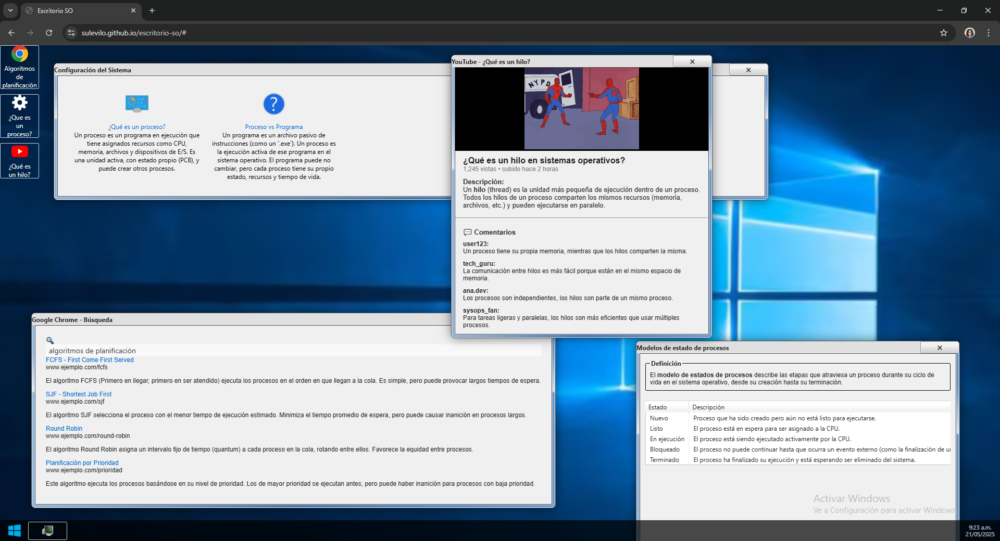

# Escritorio Interactivo de Sistemas Operativos

Este proyecto es una simulación de un escritorio tipo Windows creada con HTML, CSS y JavaScript. A través de una interfaz visual e interactiva, se explican conceptos fundamentales de **Sistemas Operativos** como procesos, hilos, modelos de estado y algoritmos de planificación.

**Suleidy Viloria**  
Actividad 4 – Asignatura: **Sistemas Operativos - 7CR**  
Docente: **Juan Carlos Rodríguez**
---

---

**[enlace aplicación interactiva](https://sulevilo.github.io/escritorio-so)**

**[Ver video de presentación](https://drive.google.com/file/d/1KucfxtWTMZhyiGz2A4KfDKMU4B_VgipM/view?usp=sharing)**

**[repositorio en GitHub](https://github.com/sulevilo/escritorio-so)**

## Temas abordados

- ¿Qué es un proceso? ¿En qué se diferencia de un programa?
- Modelo de 5 estados de procesos (Nuevo, Listo, En ejecución, Bloqueado, Terminado)
- ¿Qué es un hilo?
- Algoritmos de planificación:  
  - FCFS (First Come First Served)  
  - SJF (Shortest Job First)  
  - Round Robin  
  - Por Prioridad

Cada uno de estos temas está representado visualmente a través de íconos, ventanas y contenido multimedia en la interfaz del escritorio.

## Tecnologías utilizadas

- HTML5  
- CSS3 (con estilo retro gracias a [7.css](https://khang-nd.github.io/7.css/))  
- JavaScript
